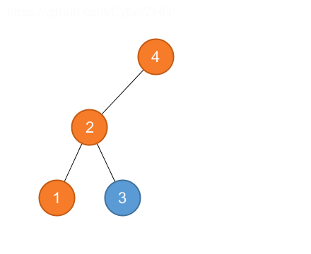

## 12.2 Querying a binary search tree

### 12.2-1

> Suppose that we have numbers between 1 and 1000 in a binary search tree, and we want to search for the number 363. Which of the following sequences could not be the sequence of nodes examined?

> a. 2, 252, 401, 398, 330, 344, 397, 363.

> b. 924, 220, 911, 244, 898, 258, 362, 363.

> c. 925, 202, 911, 240, 912, 245, 363.

> d. 2, 399, 387, 219, 266, 382, 381, 278, 363.

> e. 935, 278, 347, 621, 299, 392, 358, 363.

c is impossible since 911 < 912.
e is impossible since 299 < 347.

### 12.2-2

> Write recursive versions of TREE-MINIMUM and TREE-MAXIMUM.

```python
class TreeNode:
    def __init__(self, val, left=None, right=None):
        self.val = val
        self.left = left
        self.right = right


def tree_minimum(root):
    if root is None:
        return None
    if root.left is None:
        return root.val
    return tree_minimum(root.left)


def tree_maximum(root):
    if root is None:
        return None
    if root.right is None:
        return root.val
    return tree_maximum(root.right)
```

### 12.2-3

> Write the TREE-PREDECESSOR procedure.

```python
class TreeNode:
    def __init__(self, val, left=None, right=None):
        self.val = val
        self.parent = None
        self.left = left
        self.right = right
        if left is not None:
            left.parent = self
        if right is not None:
            right.parent = self


def tree_maximum(root):
    if root is None:
        return None
    if root.right is None:
        return root
    return tree_maximum(root.right)


def tree_predecessor(root):
    if root is None:
        return None
    if root.left is not None:
        return tree_maximum(root.left)
    p = root.parent
    while p is not None and root == p.left:
        root = p
        p = p.parent
    return p
```

### 12.2-4

> Professor Bunyan thinks he has discovered a remarkable property of binary search trees. Suppose that the search for key $$k$$ in a binary search tree ends up in a leaf. Consider three sets: $$A$$, the keys to the left of the search path; $$B$$, the keys on the search path; and $$C$$, the keys to the right of the search path. Professor Bunyan claims that any three keys $$a \in A$$, $$b \in B$$, and $$c \in C$$ must satisfy $$a \le b \le c$$. Give a smallest possible counterexample to the professor's claim.



3 < 4

### 12.2-5

> Show that if a node in a binary search tree has two children, then its successor has no left child and its predecessor has no right child.

If its successor has left child, then the left child is less than successor and it's larger than the node, thus the successor is not the successor.

### 12.2-6

> Consider a binary search tree $$T$$ whose keys are distinct. Show that if the right subtree of a node $$x$$ in $$T$$ is empty and $$x$$ has a successor $$y$$, then $$y$$ is the lowest ancestor of $$x$$ whose left child is also an ancestor of $$x$$. (Recall that every node is its own ancestor.)

TREE-SUCCESSOR

### 12.2-7

> An alternative method of performing an inorder tree walk of an $$n$$-node binary search tree finds the minimum element in the tree by calling TREE-MINIMUM and then making $$n - 1$$ calls to TREE-SUCCESSOR. Prove that this algorithm runs in $$\Theta(n)$$ time.

Based on 12.2-8, it takes $$ O(h + n + n - 1)$$ time, therefore it's $$\Theta(n)$$.

### 12.2-8

> Prove that no matter what node we start at in a height-$$h$$ binary search tree, $$k$$ successive calls to TREE-SUCCESSOR take $$O(k + h)$$ time.

Suppose $$x$$ is the starting node and $$y$$ is the ending node. The distance between $$x$$ and $$y$$ is at most $$2h$$, and all the edges connecting the $$k$$ nodes are visited twice, therefore it takes $$O(k + h)$$ time.

### 12.2-9

> Let $$T$$ be a binary search tree whose keys are distinct, let $$x$$ be a leaf node, and let $$y$$ be its parent. Show that $$y.key$$ is either the smallest key in $$T$$ larger than $$x.key$$ or the largest key in $$T$$ smaller than $$x.key$$.

TREE-SUCCESSOR
