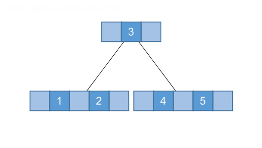
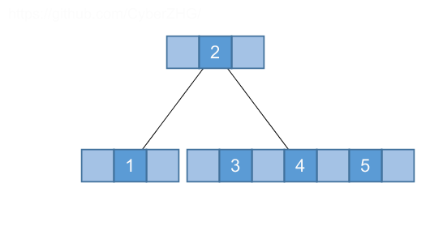
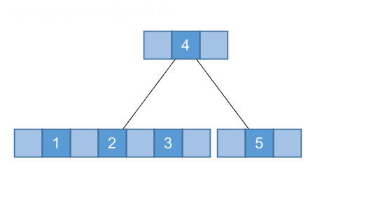
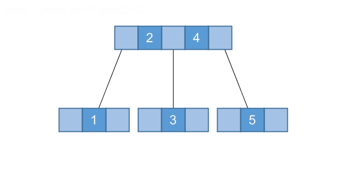

## 18.1 Definition of B-trees

### 18.1-1

> Why don't we allow a minimum degree of $t = 1$?

No key.

### 18.1-2

> For what values of $t$ is the tree of Figure 18.1 a legal B-tree?

2 or 3.

### 18.1-3

> Show all legal B-trees of minimum degree 2 that represent $\{1, 2, 3, 4, 5\}$.

### 18.1-4

> As a function of the minimum degree $t$, what is the maximum number of keys that can be stored in a B-tree of height $h$?

$$
\begin{array}{rll}
n &=& (1 + 2t + (2t) ^ 2 + \cdots + (2t) ^ {h}) \cdot (2t - 1) \\
&=& (2t)^{h + 1} - 1
\end{array}
$$
### 18.1-5

> Describe the data structure that would result if each black node in a red-black tree were to absorb its red children, incorporating their children with its own.

$t=2$, 2-3-4 tree
