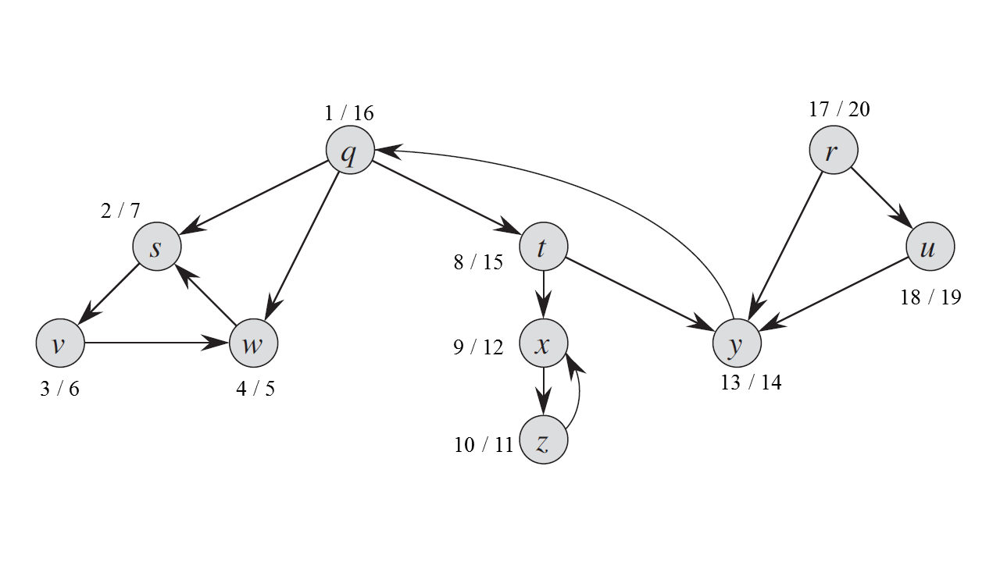

## 22.5 Strongly connected components

### 22.5-1

> How can the number of strongly connected components of a graph change if a new edge is added?

$$-(K - 1) \sim +1$$.

### 22.5-2

> Show how the procedure STRONGLY-CONNECTED-COMPONENTS works on the graph of Figure 22.6. Specifically, show the finishing times computed in line 1 and the forest produced in line 3. Assume that the loop of lines 5–7 of DFS considers vertices in alphabetical order and that the adjacency lists are in alphabetical order.

{r}, {u}, {q, y, t}, {x, z}, {s, w, v}

### 22.5-3

> Professor Bacon claims that the algorithm for strongly connected components would be simpler if it used the original (instead of the transpose) graph in the second depth-first search and scanned the vertices in order of _increasing_ finishing times. Does this simpler algorithm always produce correct results?

No.

### 22.5-4

> Prove that for any directed graph $$G$$, we have $$((G^T)^{SCC})^T = G^{SCC}$$. That is, the transpose of the component graph of $$G^T$$ is the same as the component graph of $$G$$.

