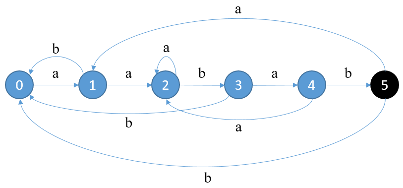

## 32.3 String matching with finite automata

### 32.3-1

> Construct the string-matching automaton for the pattern $P = aabab$ and illustrate its operation on the text string $T = aaababaabaababaab$.

$0 \rightarrow 1 \rightarrow 2 \rightarrow 2 \rightarrow 3 \rightarrow 4 \rightarrow 5$ $\rightarrow$ $1 \rightarrow 2 \rightarrow 3 \rightarrow 4 \rightarrow 2 \rightarrow 3 \rightarrow 4 \rightarrow 5$ $\rightarrow$ $1 \rightarrow 2 \rightarrow 3$.

### 32.3-2

> Draw a state-transition diagram for a string-matching automaton for the pattern
$ababbabbababbababbabb$ over the alphabet $\sigma = \{a, b\}$.

| State | a | b |
|:-----:|:-:|:-:|
|   0   | 1 | 0 |
|   1   | 1 | 2 |
|   2   | 3 | 0 |
|   3   | 1 | 4 |
|   4   | 3 | 5 |
|   5   | 6 | 0 |
|   6   | 1 | 7 |
|   7   | 3 | 8 |
|   8   | 9 | 0 |
|   9   | 1 |10 |
|  10   |11 | 0 |
|  11   | 1 |12 |
|  12   | 3 |13 |
|  13   |14 | 0 |
|  14   | 1 |15 |
|  15   |16 | 8 |
|  16   | 1 |17 |
|  17   | 3 |18 |
|  18   |19 | 0 |
|  19   | 1 |20 |
|  20   | 3 |21 |
|  21   | 9 | 0 |

### 32.3-3

> We call a pattern $P$ __*nonoverlappable*__ if $P_k \sqsupset P_q$ implies $k = 0$ or $k = q$. Describe the state-transition diagram of the string-matching automaton for a nonoverlappable pattern.

$\delta(q, a) \in \{q+1, 0\}$.

### 32.3-4 $\star$

> Given two patterns $P$ and $P'$, describe how to construct a finite automaton that determines all occurrences of either pattern. Try to minimize the number of states in your automaton.

Combine the common prefix and suffix.

### 32.3-5

> Given a pattern $P$ containing gap characters (see Exercise 32.1-4), show how to build a finite automaton that can find an occurrence of $P$ in a text $T$ in $O(n)$ matching time, where $n = |T|$.

Split the string with the gap characters, build finite automatons for each substring. When a substring is matched, moved to the next finite automaton.
